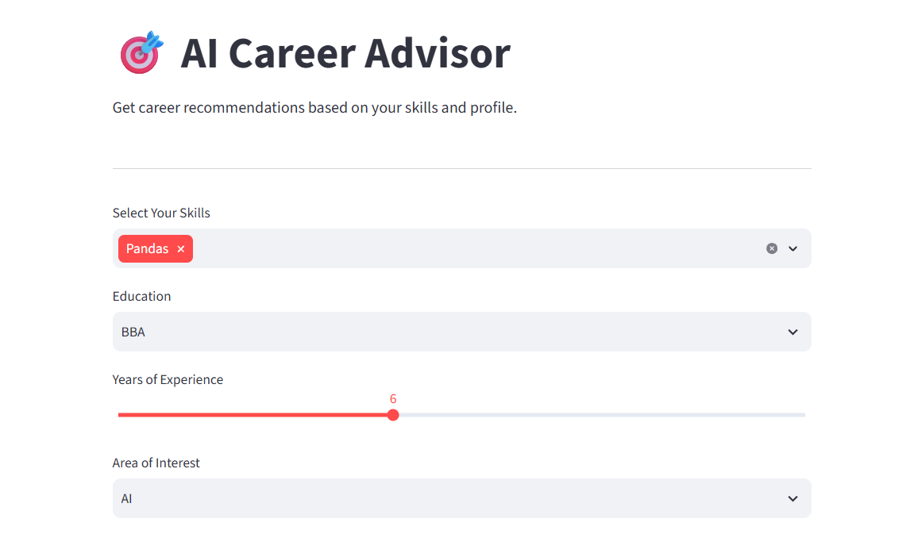

# 🎯 AI Career Advisor

An AI-powered Career Advisor built with **Python**, **Scikit-learn**, and **Streamlit** that recommends suitable career paths based on a user's **skills, education, experience, and interests**.

## 🚀 Live Demo

🔗 **Streamlit App:**  
https://ai-career-advisor-vd3f3zdvbgvj2xqtneev4u.streamlit.app/

---

## 📸 Application Preview



---

## ✨ Features

- 🎯 Predicts suitable career paths using Machine Learning
- 🧠 Considers Skills, Education, Experience, and Interests
- 📊 User-friendly Streamlit interface
- ⚡ Instant career recommendations
- 🤖 Random Forest Classifier for accurate predictions
- 📱 Responsive and interactive web application

---

## 🛠️ Tech Stack

- Python
- Streamlit
- Pandas
- Scikit-learn
- Pickle

---

## 📂 Project Structure

```
AI-Career-Advisor/
│
├── app.py
├── train_model.py
├── utils.py
├── career_dataset.csv
├── model.pkl
├── skills_encoder.pkl
├── label_encoder.pkl
├── requirements.txt
├── README.md
├── LICENSE
├── .gitignore
├── dashboard.png
```

---

## ⚙️ Installation

### Clone the repository

```bash
git clone https://github.com/sushmarakesh17/AI-Career-Advisor.git
```

### Navigate to the project

```bash
cd AI-Career-Advisor
```

### Install dependencies

```bash
pip install -r requirements.txt
```

### Run the application

```bash
streamlit run app.py
```

---

## 🧠 Machine Learning Workflow

1. Load the career dataset
2. Preprocess skills and encode categorical features
3. Train a Random Forest Classifier
4. Save the trained model and encoders
5. Accept user inputs through Streamlit
6. Predict the most suitable career path

---

## 📊 Input Parameters

- Skills
- Education
- Experience
- Area of Interest

---

## 🎯 Sample Career Recommendations

- Data Scientist
- Data Analyst
- Machine Learning Engineer
- AI Engineer
- Software Engineer
- Full Stack Developer
- Cloud Engineer
- DevOps Engineer
- MLOps Engineer
- Business Analyst
- Power BI Developer
- Tableau Developer
- Data Engineer
- Cyber Security Analyst
- NLP Engineer
- Computer Vision Engineer
- Research Scientist

---

## 📌 Future Enhancements

- Resume Upload & Analysis
- Skill Gap Analysis
- Personalized Learning Roadmap
- Job Recommendation Integration
- Salary Prediction
- Career Growth Visualization
- AI Chatbot for Career Guidance

---

## 👩‍💻 Author

**Sushma Rakesh**

GitHub: https://github.com/sushmarakesh17

---

## ⭐ Support

If you found this project useful, please consider giving it a ⭐ on GitHub.
